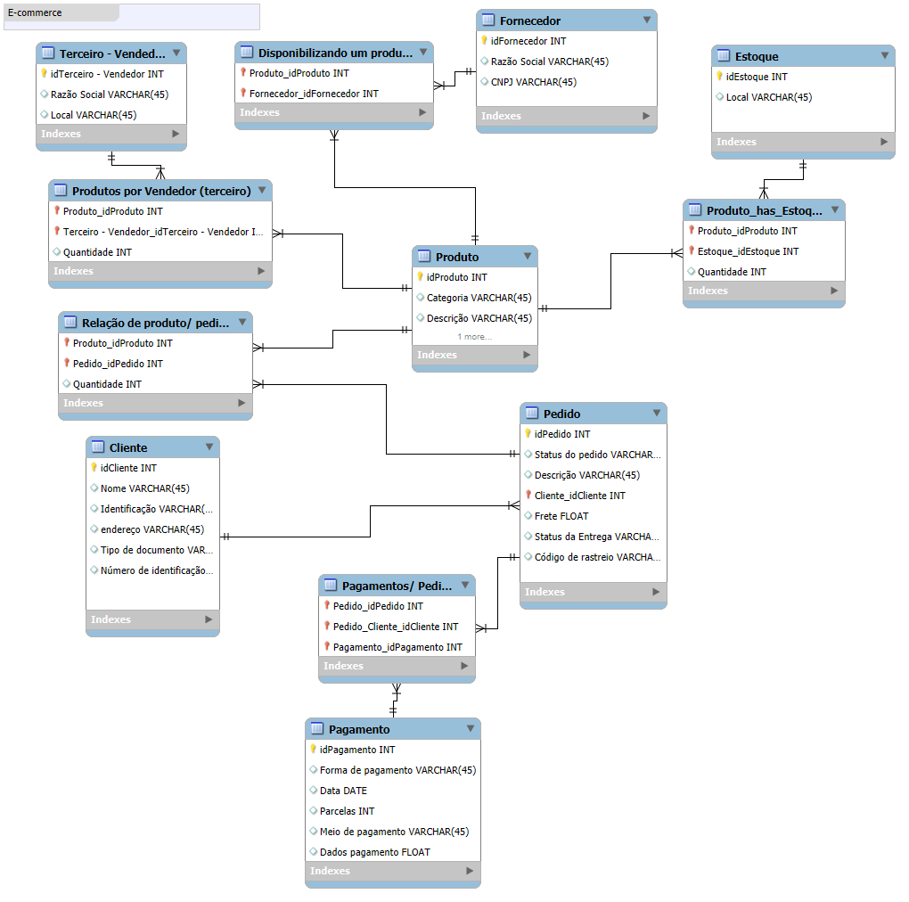

# Refinando um Projeto Conceitual de Banco de Dados

## 📌 Descrição da Atividade
Este repositório contém o desenvolvimento e refinamento de um **projeto conceitual de banco de dados** voltado para um **sistema de e-commerce**.  

O objetivo da atividade foi partir de um modelo inicial e aplicar ajustes e melhorias, incorporando regras de negócio e relacionamentos adicionais para deixar o banco mais próximo de um ambiente realista.

---

## 🎯 Objetivos do Refinamento
- Diferenciar **clientes Pessoa Física (PF) e Pessoa Jurídica (PJ)**, garantindo que cada conta seja apenas de um tipo.  
- Permitir que um **pedido tenha múltiplas formas de pagamento**.  
- Adicionar a entidade **Entrega**, com atributos de **status** e **código de rastreio**.  
- Garantir consistência nos relacionamentos entre **Produto, Pedido, Estoque e Fornecedor**.  
- Incluir entidades auxiliares para mapear relações N:N, como:  
  - Produtos em pedidos.  
  - Pagamentos associados a pedidos.  
  - Disponibilidade de produtos por estoque e fornecedores.  

---

## 🗂️ Estrutura do Modelo
As principais entidades do modelo refinado são:

- **Cliente**  
  - Pode ser PF (com CPF e data de nascimento) ou PJ (com CNPJ e razão social).  
- **Pedido**  
  - Associado a um cliente.  
  - Relacionado a produtos, pagamentos e entrega.  
- **Pagamento**  
  - Suporta múltiplas formas por pedido (PIX, cartão, boleto, etc).  
- **Entrega**  
  - Inclui status e código de rastreio.  
- **Produto, Estoque, Fornecedor e Terceiro-Vendedor**  
  - Controlam a disponibilidade e origem dos produtos no sistema.  

---

## 📊 Modelo Entidade-Relacionamento
O diagrama refinado contempla:
- Relacionamento **1:N entre Cliente e Pedido**.  
- Especialização de **Cliente em PF ou PJ**.  
- Relacionamento **N:N entre Pedido e Pagamento** (resolvido com tabela associativa).  
- Relacionamento **1:1 entre Pedido e Entrega**.  
- Controle de disponibilidade de produtos em diferentes estoques e vendedores.  

---

## 🚀 Tecnologias e Ferramentas
- Modelagem: **MySQL Workbench / Draw.io / Graphviz**  
- Linguagem de definição: **SQL (DDL)**  
- Documentação: **Markdown (README.md)**  

